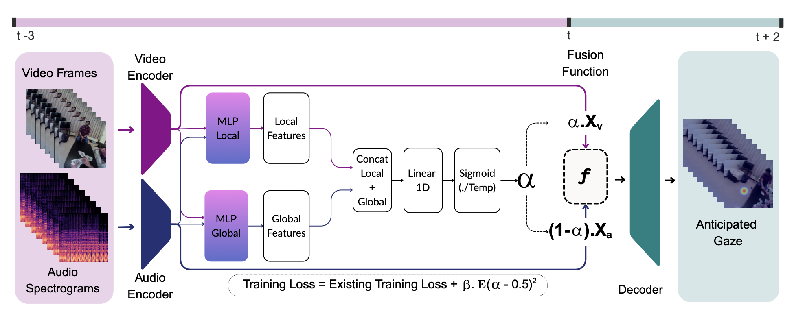

# Sensory Spotlight: Dynamic Multimodal Fusion for Anticipating Human Attention

### NeurIPS 2025 Submission

*(Author details withheld for anonymity)*

### [Project Page (CSTS Reference)](https://bolinlai.github.io/CSTS-EgoGazeAnticipation/)

---

## Problem & Approach

How can we model human-like attention shifting to dynamically prioritize sensory inputs?

We introduce **ALFA (Adaptive Learning for Fusion Alignment)** — a context-aware dynamic fusion policy designed to model the varying importance of audio and visual modalities in egocentric gaze anticipation. ALFA operates as a lightweight plug-in module that learns adaptive fusion weights **without modifying the base architecture**. This simplicity enables seamless integration into existing pipelines like CSTS.

<p align="center">
  
</p>

---

## Setup

Our implementation introduces a plug-and-train module that builds on existing architectures with minimal changes. Specifically, we extend the original [CSTS repository](https://github.com/BolinLai/CSTS) by integrating our ALFA module.

Please follow the setup instructions provided in the CSTS repository to configure the environment.
You can directly clone this repository — it includes a complete version of CSTS with ALFA integrated.

For clarity, we outline the key modules and modifications introduced by ALFA below, to help you understand how the dynamic fusion mechanism is incorporated into the CSTS pipeline.

---

## Datasets, Training & Evaluation

We train and evaluate on a subset of the **Ego4D** and **Aria Everyday Activities** datasets using **5-fold cross-validation**.
Modified train/test splits are available under:

```
data/folds_output_ego4d/
data/folds_output_aria/
```

To prepare the datasets and download pretrained model weights, please follow the CSTS instructions.
Training and evaluation scripts follow the same structure, with only minor additions for our fusion regularizer and fold-specific control.

---

## What’s New in the ALFA Addon?

* 🔄 **ALFA module**: Our dynamic fusion policy implemented in [`slowfast/models/ALFA.py`](slowfast/models/ALFA.py)
* 🧠 **Fusion policy integration**: Integrated into the CSTS model to learn context-sensitive fusion weights during training.
* 📊 **Fold-by-fold evaluation**: Scripts adapted for automated 5-fold cross-validation with per-fold checkpoints and logs.
* 🧮 **Regularization additions**: Added a loss regularizer to encourage temporal diversity in learned fusion weights.

---

## Acknowledgements

Our implementation is based on the excellent open-source codebases of

* [SlowFast](https://github.com/facebookresearch/SlowFast)
* [CSTS](https://github.com/BolinLai/CSTS)

We thank the original authors for making their work publicly available and enabling ours.
